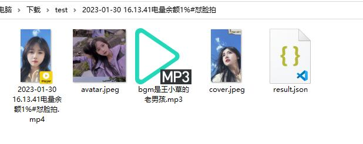

# 抖音收藏夹知识库流水线

> **把收藏夹里的碎片内容，变成可以复盘、搜索、总结和二次创作的个人知识资产。**

批量下载抖音收藏夹 → 提取口播文案 → 导出结构化日志，方便导入 Obsidian、Notion 或交给 AI 做总结分析。

[](LICENSE)
[](requirements.txt)

---

## 这个项目解决什么痛点？

很多人收藏了大量学习、创业、AI、商业类短视频，但这些内容：

- 散落在抖音收藏夹里，**很难系统复盘**
- 标题看过就忘，**口播干货无法搜索**
- 想导入笔记软件或交给 AI 总结时，**缺少结构化本地资料**

本项目希望把抖音收藏夹中的**视频、封面、音频、标题、元数据和口播文案**沉淀为本地资料，构建个人知识库流水线。

## Demo

> 截图可替换为你自己的运行结果，建议保留终端下载、输出目录、知识库三视图。




## 完整工作流

```
Douyin 收藏夹
    ↓
download_collects.py  批量下载
    ↓
视频 / 封面 / 音频 / 元数据
    ↓
extract_transcript.py  提取口播文案
    ↓
CSV / JSON / TXT
    ↓
Obsidian / AI 总结 / 知识图谱
```

## ✨ 核心功能（相比原版新增）

| 功能 | 说明 |
|------|------|
| 📁 收藏夹批量下载 | `download_collects.py` 支持按收藏夹、全部收藏、交互选择 |
| 🎙️ 口播文案提取 | `extract_transcript.py` 支持 Vosk / Faster-Whisper |
| 📊 结构化日志 | 自动生成 CSV + JSON，便于后续知识库整理 |
| 🍪 Cookie 工具 | 自动/手动获取 Cookie，详见 `USAGE.md` |

## 🚀 快速开始

### 环境要求

- Python 3.8+（Vosk）或 Python 3.9+（Whisper）
- Windows / macOS / Linux

### 安装

```bash
git clone https://github.com/luxinzhang28-creator/Douyin-collect-downloader.git
cd Douyin-collect-downloader
pip install -r requirements.txt -i https://pypi.tuna.tsinghua.edu.cn/simple
```

### 使用流程

```bash
# 1. 获取 Cookie（首次使用）
python cookie_extractor.py
# 或: python get_cookies_manual.py

# 2. 复制配置模板并填入 Cookie
cp config.example.yml config.yml

# 3. 下载收藏夹
python download_collects.py              # 交互选择
python download_collects.py --all        # 下载全部收藏夹

# 4. 提取口播文案（需额外安装 vosk 依赖）
pip install -r requirements-transcript-vosk.txt
python extract_transcript.py --backend vosk --path "./Downloaded/collects"
```

## 📂 输出文件示例

下载并转写完成后，目录结构大致如下：

```
Downloaded/collects/
├── download_log_latest.csv          # 最新下载日志（总表）
├── download_log_latest.json
├── 激励/                            # 收藏夹名称
│   ├── 作者名_视频标题/
│   │   ├── 作者名_视频标题_video.mp4
│   │   ├── 作者名_视频标题_music.mp3
│   │   ├── 作者名_视频标题_cover.jpg
│   │   ├── 作者名_视频标题_result.json   # 元数据（标题、链接、作者等）
│   │   └── 作者名_视频标题_transcript.txt # 口播全文
│   └── ...
└── 创业/
    └── ...
```

`download_log_latest.csv` 便于用 Excel / Notion 做总表管理；`*_result.json` 和 `*_transcript.txt` 便于导入 Obsidian 或交给 AI 总结。

## 📋 脚本说明

| 脚本 | 用途 |
|------|------|
| `download_collects.py` | **收藏夹下载**（本项目核心） |
| `extract_transcript.py` | 口播转文字 |
| `DouYinCommand.py` | V1.0 稳定版（单视频/主页） |
| `downloader.py` | V2.0 增强版（异步/自动 Cookie） |
| `cookie_extractor.py` | Playwright 自动获取 Cookie |
| `get_cookies_manual.py` | 手动获取 Cookie |

## FAQ

### 为什么需要 Cookie？

收藏夹属于登录后内容，需要通过 Cookie 识别当前账号。Cookie 仅保存在你本地的 `config.yml` 中，不会上传。

### Cookie 会上传到 GitHub 吗？

**不会。** 请勿提交 `config.yml`、`cookies.txt` 等私人文件。本项目已在 `.gitignore` 中忽略这些路径。

### 为什么转写效果不完美？

Vosk 模型较轻量，适合本地快速使用、对 Python 版本要求低。如果追求更高准确率，可使用 Faster-Whisper（需 Python 3.9+）：

```bash
pip install -r requirements-transcript.txt
python extract_transcript.py --backend whisper --path "./Downloaded/collects"
```

### 下载失败怎么办？

1. 检查 Cookie 是否过期，重新运行 `cookie_extractor.py`
2. 确认收藏夹为登录账号可见
3. 查看 `download_log_latest.json` 中的错误记录

### 可以商用吗？

不可以。本项目仅供学习交流，请遵守法律法规及抖音平台服务条款，尊重原作者版权。

## Roadmap

- [ ] 自动生成 Obsidian Markdown（`export_obsidian.py`）
- [ ] 自动按主题分类收藏视频
- [ ] 接入大模型批量总结
- [ ] 生成知识图谱节点
- [ ] 增加图形化界面
- [ ] 支持一键导出选题库

欢迎通过 [Issues](https://github.com/luxinzhang28-creator/Douyin-collect-downloader/issues) 提出需求或参与贡献。

## Credits

本项目基于以下开源项目二次开发，感谢原作者与社区：

- [jiji262/douyin-downloader](https://github.com/jiji262/douyin-downloader)
- [Mu-L/douyin-downloader](https://github.com/Mu-L/douyin-downloader)

## ⚠️ 免责声明

- 本项目仅供**学习交流**使用
- 请遵守相关法律法规及抖音平台服务条款
- 不得用于商业用途或侵犯他人版权
- 下载内容请尊重原作者权益

## 📄 许可证

本项目采用 [MIT License](LICENSE) 开源许可证。

---

如果这个项目对你有帮助，请给个 ⭐ Star！
