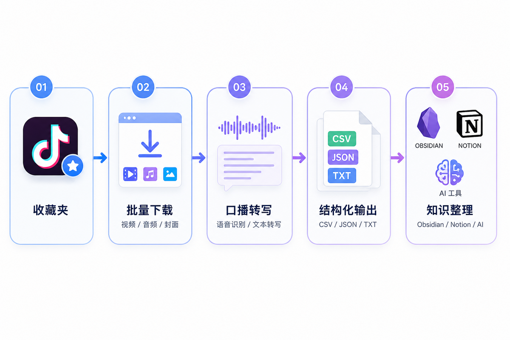
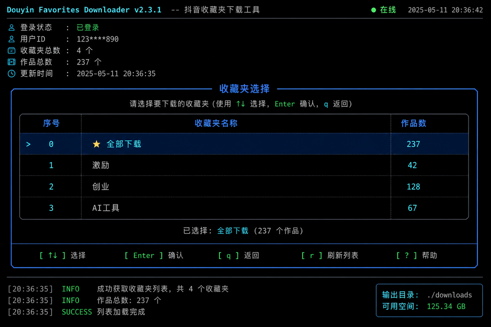
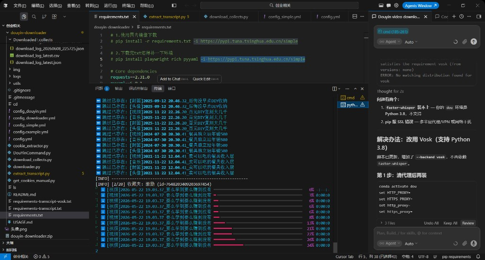
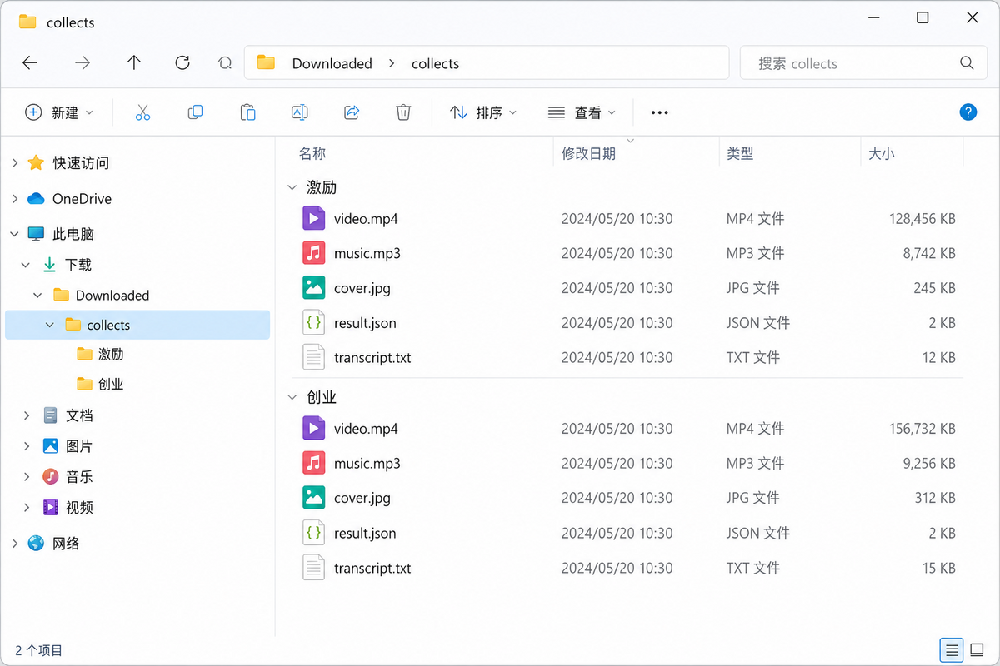

<div align="center">

[](README.md)
[](README_en.md)

# 抖音收藏夹下载器

<h3>收藏了 300 条视频，却一条都没复盘过？</h3>

**抖音收藏夹批量下载 · 口播转文字 · 结构化整理**

把「只收藏、不看」的内容，变成可搜索、可统计、可分析的本地资料。

[](LICENSE)
[](requirements.txt)
[](download_collects.py)

[快速开始](#-快速开始) · [功能亮点](#-功能亮点) · [效果预览](#-效果预览) · [使用文档](USAGE.md)

</div>

---

## 一句话说清楚

> 这不是又一个「视频下载器」，而是一套 **收藏夹资料整理流水线**：
> 交互式选择收藏夹 → 批量下载 → 提取口播文案 → 输出 CSV/JSON，供运营分析或知识库沉淀。

它**不会**自动帮你生成知识库，但会把最难的第一步——**把收藏夹里的碎片内容搬到本地并结构化**——做到足够简单。

---

## 效果预览

### 整体流程



### 交互式收藏夹选择（Rich TUI）

不用记命令，运行后像「菜单」一样点选收藏夹：



| 输入 | 效果 |
|------|------|
| `0` | 下载全部收藏夹 |
| `2` | 只下载第 2 个收藏夹 |
| `1,3,5` | 下载多个指定收藏夹 |

### 真实下载进度

多线程下载、跳过已存在文件、实时进度条：



### 下载完成后的本地目录

视频、封面、音频、元数据、口播文案，按收藏夹分类存放：



---

## 功能亮点

### 1. 三种下载来源，覆盖你的全部收藏

```bash
python download_collects.py                    # 交互式：先选来源，再选收藏夹
python download_collects.py --all              # 一键下载全部收藏夹
python download_collects.py --mode favorites   # 只下载「收藏的视频」
python download_collects.py --mode both        # 收藏夹 + 收藏视频都要
```

| 模式 | 适合谁 |
|------|--------|
| **收藏夹** | 你按主题建了「激励」「创业」「AI」等文件夹 |
| **收藏的视频** | 你随手收藏、没分类的全部视频 |
| **两者都要** | 一次性全量备份 |

### 2. 好看的终端交互，不是冷冰冰的命令行

基于 [Rich](https://github.com/Textualize/rich) 库打造：

- 彩色表格展示收藏夹名称和作品数量
- 下载前确认面板，避免误操作
- 实时进度条 + 跳过/成功/失败状态
- 支持中文收藏夹名、Windows / Linux / macOS

### 3. 口播转文字，让视频「可被搜索」

```bash
python extract_transcript.py --backend vosk --path "./Downloaded/collects"
```

每个视频输出 `*_transcript.txt`，并写入 `*_result.json`，标题和口播分开存储。

### 4. 结构化日志，运营和整理都好用

自动生成 `download_log_latest.csv` / `.json`，字段包含：收藏夹、标题、作者、链接、状态、本地路径等——直接丢进 Excel 做选题分析。

### 5. Cookie 获取有手把手的教程

- `cookie_extractor.py`：Playwright 自动打开浏览器登录
- `get_cookies_manual.py`：F12 复制 Cookie，逐步引导
- 统一保存到 `config.yml`，和主流程一致

---

## 和「普通下载器」有什么不同？

| | 普通 douyin-downloader | 本项目 |
|--|------------------------|--------|
| 收藏夹下载 | ❌ 不支持 | ✅ 核心功能 |
| 收藏视频（未分类） | ❌ | ✅ `--mode favorites` |
| 交互式选文件夹 | ❌ | ✅ Rich TUI 表格 |
| 口播转文字 | ❌ | ✅ Vosk / Whisper |
| 下载日志 CSV | ❌ | ✅ 自动生成 |
| 按收藏夹分目录 | ❌ | ✅ 默认开启 |

---

## 工作流程


---

## 适用人群

| 你是谁 | 你能用它做什么 |
|--------|----------------|
| 收藏党 | 全量备份收藏夹，再也不怕视频被删 |
| 短视频运营 | 批量提取口播文案，研究选题和话术结构 |
| 内容创作者 | 把收藏当素材库，本地管理 + 文字检索 |
| 知识管理爱好者 | 导出结构化资料，导入 Obsidian / Notion |
| 算法 / 编程爱好者 | 开源可改，Cursor 二创友好 |

---

## 推荐环境

| 场景 | Python |
|------|--------|
| 仅下载 + Vosk 转写 | 3.8+ |
| Faster-Whisper | 3.9+ |
| **新手推荐** | **3.10** |

---

## 快速开始

```bash
# 1. 克隆
git clone https://github.com/luxinzhang28-creator/Douyin-collect-downloader.git
cd Douyin-collect-downloader

# 2. 安装（含 Playwright）
pip install -r requirements.txt -i https://pypi.tuna.tsinghua.edu.cn/simple
playwright install chromium

# 3. 获取 Cookie
python cookie_extractor.py
cp config.example.yml config.yml

# 4. 交互式下载（推荐第一次使用）
python download_collects.py

# 5. 提取口播
pip install -r requirements-transcript-vosk.txt -i https://pypi.tuna.tsinghua.edu.cn/simple
python extract_transcript.py --backend vosk --path "./Downloaded/collects"
```

Cookie 详细教程见 **[USAGE.md](USAGE.md)**（建议新手完整读一遍）。

---

## 输出目录结构

```
Downloaded/collects/
├── download_log_latest.csv       ← 总表，Excel 可打开
├── download_log_latest.json
├── 激励/
│   └── 作者_标题/
│       ├── *_video.mp4
│       ├── *_music.mp3
│       ├── *_cover.jpg
│       ├── *_result.json         ← 元数据
│       └── *_transcript.txt     ← 口播全文
└── 创业/
    └── ...
```

---

## 脚本一览

| 脚本 | 说明 |
|------|------|
| `download_collects.py` | 收藏夹下载主程序，Rich 交互 |
| `extract_transcript.py` | 视频口播 → 文字 |
| `cookie_extractor.py` | 浏览器自动登录取 Cookie |
| `get_cookies_manual.py` | 手动粘贴 Cookie |
| `downloader.py` / `DouYinCommand.py` | 附赠：单视频 / 主页下载 |

---

## FAQ

<details>
<summary><b>为什么需要 Cookie？</b></summary>

收藏夹是登录后才能看的内容，Cookie 相当于你的登录凭证，只保存在本地 `config.yml`。
</details>

<details>
<summary><b>Cookie 会上传 GitHub 吗？</b></summary>

不会，已在 `.gitignore` 排除。详见 [SECURITY.md](SECURITY.md)。
</details>

<details>
<summary><b>转写不准怎么办？</b></summary>

换 Faster-Whisper：`pip install -r requirements-transcript.txt` 后加 `--backend whisper`。
</details>

---

## Roadmap

- [ ] `export_obsidian.py` 一键导出 Markdown 笔记
- [ ] 按主题自动打标签
- [ ] 大模型批量总结接口
- [ ] 图形化界面（GUI）
- [ ] 选题库 CSV 导出模板

有想法？欢迎 [提 Issue](https://github.com/luxinzhang28-creator/Douyin-collect-downloader/issues)。

---

## Credits

基于 [jiji262/douyin-downloader](https://github.com/jiji262/douyin-downloader) 与 [Mu-L/douyin-downloader](https://github.com/Mu-L/douyin-downloader) 二次开发。

## 免责声明

仅供学习交流，请遵守法律法规及平台条款，尊重原作者版权。

## License

[MIT](LICENSE)

---

<div align="center">

**如果这个项目帮你把收藏夹「救」了出来，请点个 ⭐ Star**

</div>
